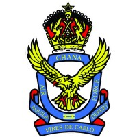

<div align="center">
  
  <h1>Ghana Air Force Engineering Command System</h1>
  <p><strong>Military-Grade Aircraft Maintenance, Engineering & Operational Management Platform</strong></p>

  <p>
    
    
    
    
    
  </p>
</div>

---

## 🦅 Overview

The **Ghana Air Force Engineering Command System (GAF-ECS)** is a centralized, real-time command platform designed to digitize and streamline the engineering and maintenance workflows of the Ghana Air Force. 

It replaces legacy physical logbooks with an interconnected, highly secure digital ecosystem. The platform enforces strict Role-Based Access Control (RBAC), automatically monitors aircraft flight hours for preventative maintenance, and provides commanding officers with real-time fleet readiness metrics.

## 🚀 Core Capabilities

- **Digital Twin Aircraft Profiles (360° View):** Instantly access the entire lifecycle, timeline, and health metrics of any airframe in the fleet.
- **Smart Flight & Maintenance Logging:** Automatic total flight hour calculation. The system autonomously triggers 100-hour phase inspection warnings.
- **Task-to-Log Pipeline:** Engineers can close out Scheduled Maintenance Tasks, instantly generating an audited draft log of the physical work performed.
- **Smart Status Interlocks:** If a pilot or engineer reports a `Critical` or `High` severity incident, the system autonomously grounds the aircraft.
- **Real-Time Command Broadcasts:** Live database notifications push instantly to Commanders and Supervisors upon the logging of high-priority defects.
- **Fleet Audit Data Exports:** Generate physical A4 Daily State Reports and stream CSV grids of any live table for morning briefings.

## 🏗️ Technical Architecture

- **Backend Logic:** Laravel 11.x
- **Dynamic Frontend:** Laravel Livewire v3 + Alpine.js
- **Styling UI:** Tailwind CSS (Custom Military-Grade `gaf-navy`, `gaf-blue` aesthetic)
- **Database:** MySQL / MariaDB

## 🔐 Role-Based Access Control (RBAC)

The system enforces strict UI and backend authorization policies. Destructive actions (like deleting aircraft or altering verified flight logs) are completely hidden from non-commissioned or unauthorized personnel.

* **Commander:** Full audit visibility, fleet reporting, and override authority.
* **Supervisor:** Task assignment, log verification, and daily state generation.
* **Engineer:** Task execution, flight/maintenance logging.
* **Auditor:** Read-only access to historical logs and data exports.

## 🛠️ Local Installation & Setup

1. **Clone the repository:**
   ```bash
   git clone https://github.com/BRIGHTEDUFUL/ENG.GAF.git
   cd airforce-system
   ```

2. **Install Composer dependencies:**
   ```bash
   composer install
   ```

3. **Install NPM dependencies:**
   ```bash
   npm install
   npm run build
   ```

4. **Environment Setup:**
   ```bash
   cp .env.example .env
   php artisan key:generate
   ```
   *Configure your `.env` file with the correct database credentials.*

5. **Run Migrations & Seeders:**
   ```bash
   php artisan migrate --seed
   ```

6. **Serve the Application:**
   ```bash
   php artisan serve
   ```

## ⚠️ Security Notice

This repository contains operational intelligence system architecture. Unauthorized access, distribution, or duplication of this framework outside of authorized military deployment is strictly prohibited. 

---
<div align="center">
  <p>🇬🇭 <i>Vires De Caelo</i> (Strength From The Skies)</p>
</div>
